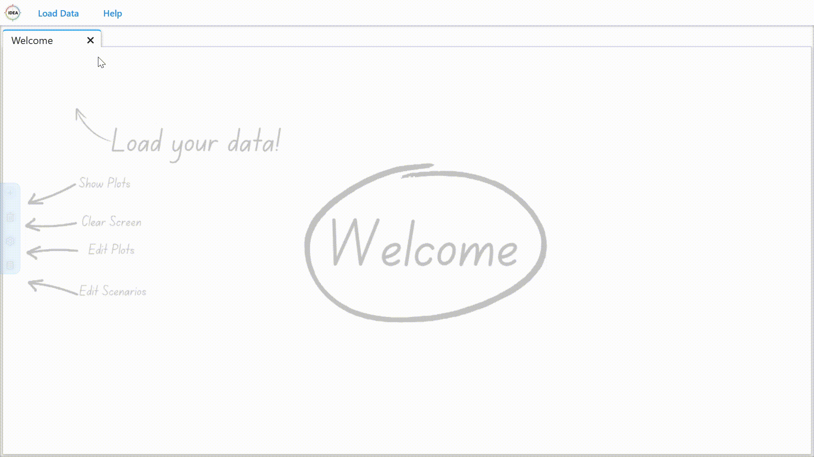
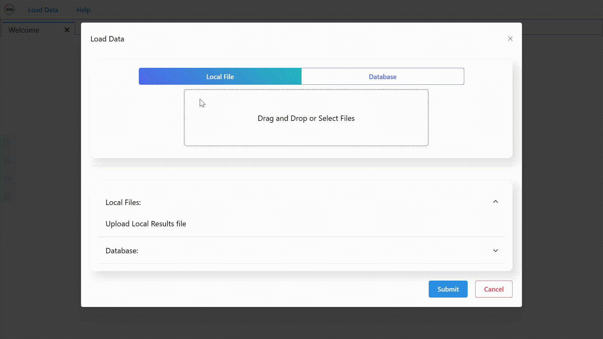
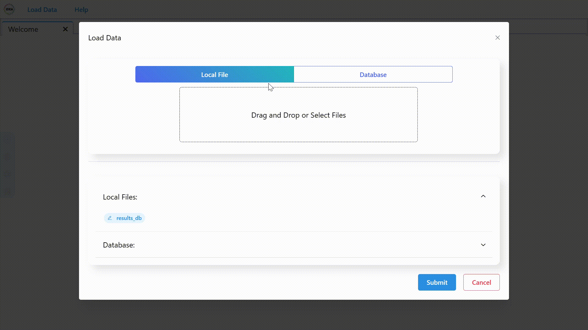
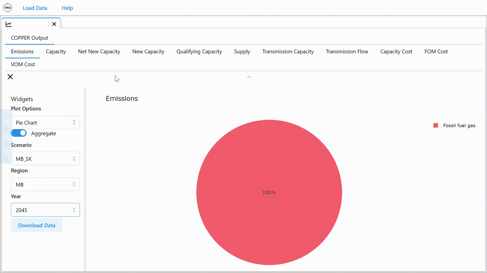
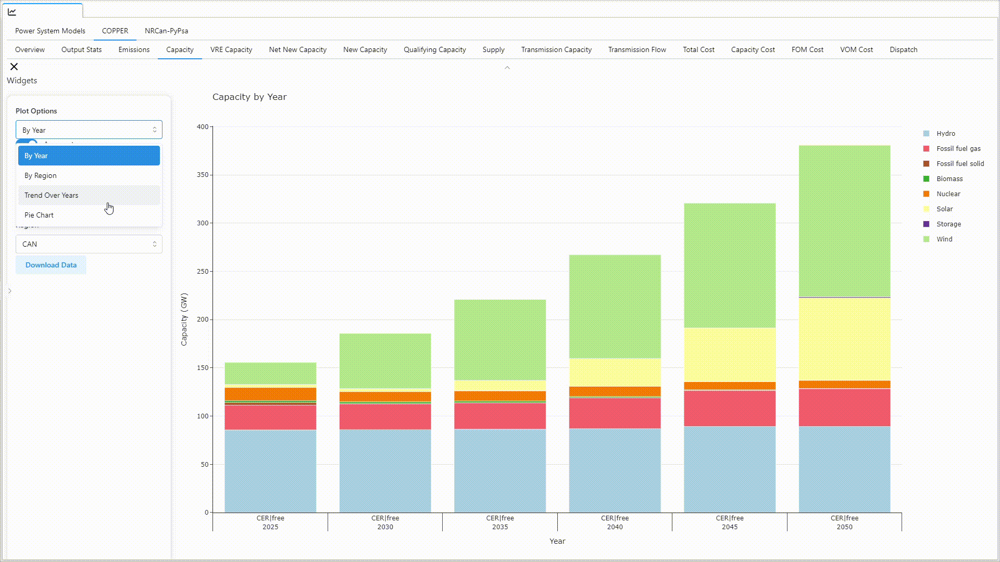
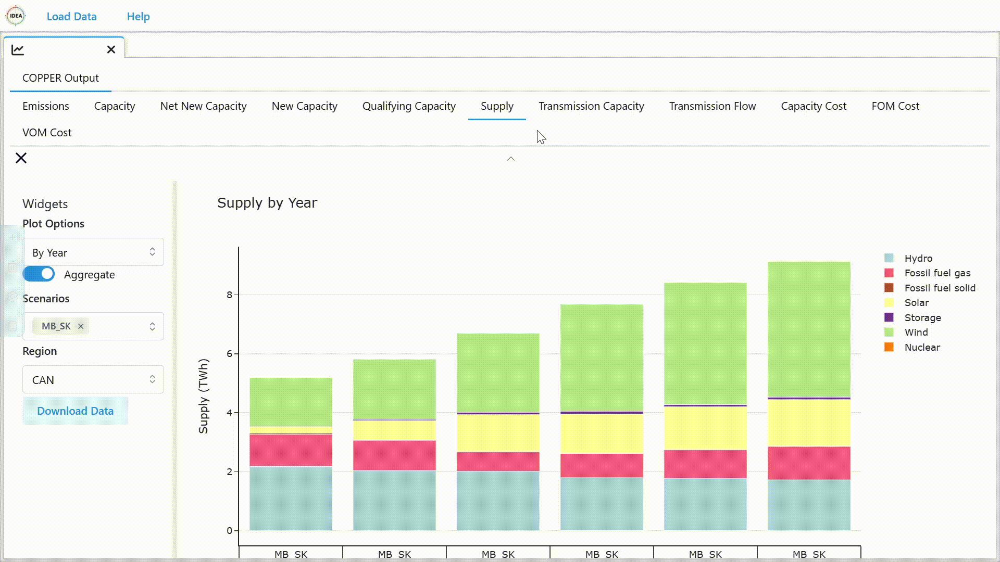
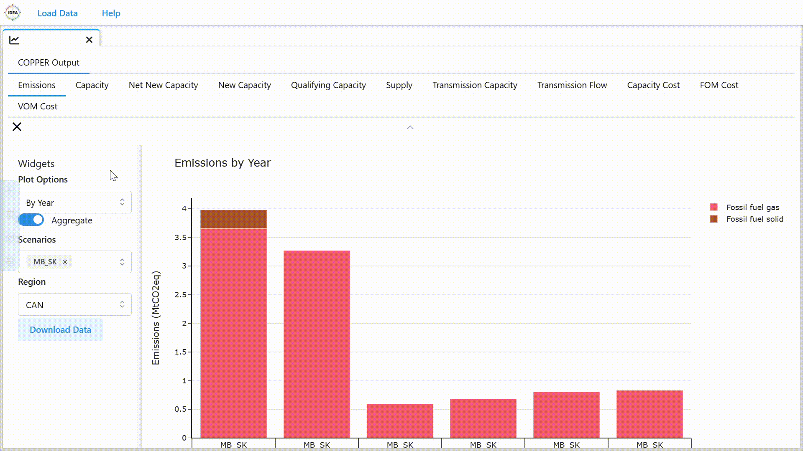

# Using IDEA

## Feature Overview

- **Load Data:** Use the "Load Data" option to either upload data from your local machine or select data from our
  results database.
- **Add Windows:** Add windows to the workspace using the "+" button in the toolbar on the left side of the screen.
- **Select Plots:** Choose the plots you want to see and adjust the content using their designated widgets.
- **Resize, Move, and Close Windows:** Arrange your workspace to compare and review your data.
- **Clear Workspace:** Use the trash bin button in the toolbar to clear your workspace.
- **Edit Plots:** Use the settings button in the toolbar to customize colors for technologies, titles, and axis labels.
- **Edit Loaded Data:** Use the last button in the toolbar to change the scenario name and the visualizations that
  should be created.

## Loading Data

### Open Data Loading Window

Click the "Load Data" button in the header. Choose to load data from your local machine or the IDEA database.

### Local Files

To load data from your local machine, click the "Local File" button. You can either click on the field or drag your
files onto the upload area. By default, any IAMC formatted data can be loaded in, even if IDEA was not extended for it.
If you have a custom model profile, you can load in data as defined by your profile, we still recommend using IAMC
formatted data for the best experience and supporting easier collaboration with other teams.

### Database

To load data from the IDEA database, click the "Database" button. Enter your API key and click "Connect." Once the data
is loaded, you can select the runs you want to use and click "Load." You can also filter the runs by the model,
scenario, or author.

## Editing Data

Once the data is loaded, you can edit the plots to be generated and change the scenario name. Click the "Submit" button
to finalize your selection. This will process the data and load it into the system.

## Plot Customization

### Change Plots

Every window has a tab bar at the top. The tab bar is nested and contains tabs for every model type available in the
data and for every model type, there are tabs for every plot option available. To change the plot, click on the tab of
the model type you want to change, then click on the tab of the plot option you want to change. The plot will update
accordingly.

### Interacting with Plots

Every plot has widgets to its left that allow you to change the plot by adjusting predefined parameters that include,
but are not limited to, the scenario, period, region, and plot type. Changing these parameters will update the plot
accordingly.

### Save Plots

To save a plot, click the "Save" button in the top right corner of the plot window. The plot will be saved as a PNG
file.

### Change View

To have a clean interface where only the plot is visible, hide the widgets by clicking the hamburger menu in the top
left corner of the window and press the "^" button to hide the tab bar. To show the widgets or tabs again, click the
hamburger menu or the "v" button accordingly.

## Managing Windows

### Add Windows

To add a window, click the "+" button in the toolbar on the left side of the screen.

### Clear Windows

To clear the workspace, click the "trash bin" in the toolbar and confirm.

### Interact with Windows

- To move a window, click and drag the title bar of the window.
- To resize a window, click and drag one of the edges of the window.

